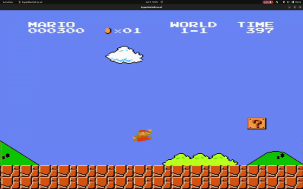
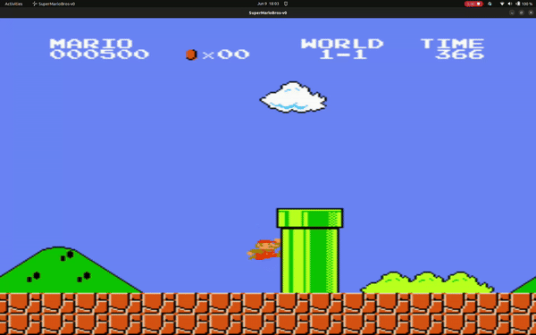
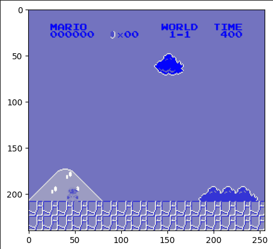
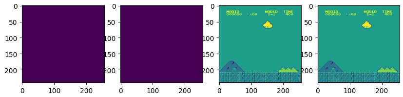

# RL-for-Super-Mario
   

## Description
This project demonstrates the application of reinforcement learning (RL) to play the Super Mario Bros game using the Proximal Policy Optimization (PPO) algorithm. The game environment undergoes pre-processing steps to prepare the state inputs for the RL agent. 

### Pre-processing Steps
1. **Grayscale Conversion**: The original game images are converted to grayscale, which reduces the computational load by simplifying the input data. This is crucial for enhancing the performance of the learning algorithm.
   
   

2. **Frame Stacking**: Multiple consecutive frames are stacked together. This technique provides a temporal dimension to the inputs, allowing the agent to understand and predict the trajectory and velocity of Mario and his enemies.

   

These preprocessing techniques are essential for efficient training of the RL agent, enabling it to perform better by understanding the dynamics of the game environment.
